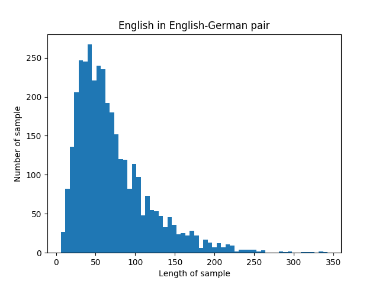
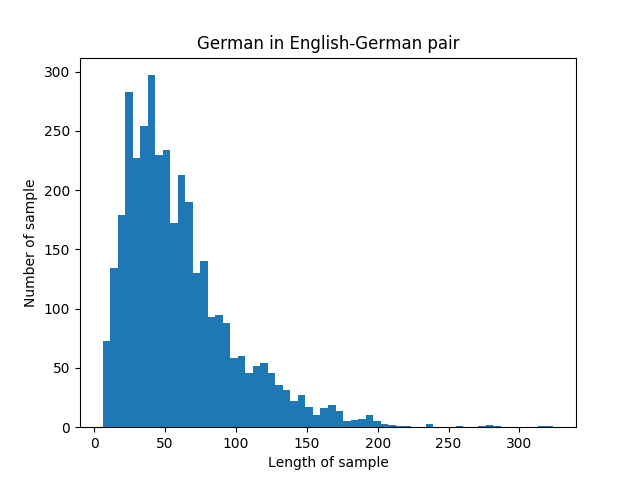
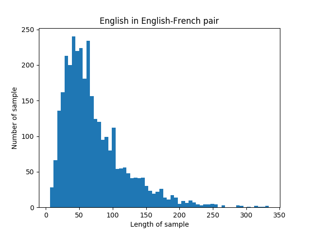
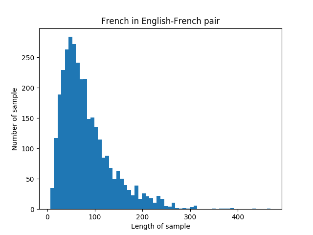

# IKEA Dataset
[](https://opensource.org/licenses/MIT)

## Citation:
If you use this dataset, you might want to cite this [paper](https://www.aclweb.org/anthology/D18-1400/):
```
@inproceedings{zhou-etal-2018-visual,
    title = "A Visual Attention Grounding Neural Model for Multimodal Machine Translation",
    author = "Zhou, Mingyang  and
      Cheng, Runxiang  and
      Lee, Yong Jae  and
      Yu, Zhou",
    booktitle = "Proceedings of the 2018 Conference on Empirical Methods in Natural Language Processing",
    month = oct # "-" # nov,
    year = "2018",
    address = "Brussels, Belgium",
    publisher = "Association for Computational Linguistics",
    url = "https://www.aclweb.org/anthology/D18-1400",
    doi = "10.18653/v1/D18-1400",
    pages = "3643--3653",
    abstract = "We introduce a novel multimodal machine translation model that utilizes parallel visual and textual information. Our model jointly optimizes the learning of a shared visual-language embedding and a translator. The model leverages a visual attention grounding mechanism that links the visual semantics with the corresponding textual semantics. Our approach achieves competitive state-of-the-art results on the Multi30K and the Ambiguous COCO datasets. We also collected a new multilingual multimodal product description dataset to simulate a real-world international online shopping scenario. On this dataset, our visual attention grounding model outperforms other methods by a large margin.",
}
```

## Introduction:

IKEA-Dataset is a dataset for multilingual-multimodal machine translation. It is published in this paper: [A Visual Attention Grounding Neural Model for Multimodal Machine Translation](https://arxiv.org/pdf/1808.08266.pdf). IKEA-Dataset contains the textual and visual data of each products available in IKEA and Under Armour websites in 2017. The textual data is the description of the products. The visual data is the images of the product. The textual data of a product is usually in pairs: the English version with corresponding the French version; or English version with corresponding German version.

## Data Preprocessing:

This repository contains the raw, unprocessed data, and two other versions of the data underwent different data-processing steps. the `IKEA/data.en.*/data.norm.tok.lc` folder contains normalized, tokenized, converted to lowercase (processed exclusively in such order) data. The `IKEA/data.en.*/data.norm.tok.lc.bpe` folder contains normalized, tokenized, converted to lowercase, byte-pair encoding (processed exclusively in such order) data. 

## Example:


## Statistics:
The below statistics is calculated with unprocessed data: 

| Language pair  | Language | Tokens | Minimum sample length | Maximum sample length | Average sample length | Standard derivation sample length | Vocabulary size |
|----------------|----------|--------|-----------------------|-----------------------|-----------------------|-----------------------------------|-----------------|
| English-German | English  | 256355 | 6                     | 343                   | 71.40807799           | 46.33073895                       | 6601            |
|                | German   | 216892 | 6                     | 324                   | 60.41559889           | 39.14467817                       | 10468           |
| English-French | English  | 239966 | 6                     | 334                   | 72.25715146           | 47.24279926                       | 6442            |
|                | French   | 275251 | 6                     | 469                   | 82.88196326           | 54.72162651                       | 7575            |


These four histogram show the sentence length distribution for each language in each languague pairs. The length of a sentence is calculate with the number tokens in the sentence: 

<div align=center>
  
  
</div>
  
## Characteristics:
- Because all data samples are the description of different products from IKEA or Under Armour, a data sample usually contain more than one sentences. 
- A description might contain information that cannot be showed in image. for example, a description for an Underamour product can contains the sentence “Don’t wash it with hot water”.
- A product's text description in German or French might be shorter than its corresponding English version.


## Data Format:

### Folder:
- `IKEA/`: data crawled and processed from IKEA and UNDERAMOUR.
- `IKEA/data.en.fr`: English-French data.
- `IKEA/data.en.de`: English-German data.
- `IKEA/data.en.*/data.raw`: unprocessed original data compressed in `.gz`. 
- `IKEA/data.en.*/data.norm.tok.lc`: normalized, tokenized and lowercase-converted data. 
- `IKEA/data.en.*/data.norm.tok.lc.bpe`: normalized, tokenized, lowercase-converted, byte-pair-encoded (10000) data.
- `IKEA/data.en.*/data.image.bpe`: image matrix for `train.*`, `test.*`, `val.*`.
- `IKEA/image/image.en.*`: compressed images in jpg format for training, validation and testing.

### Data Files:
- `train.*`: 2600+ samples for FR, 2800+ samples for DE.
- `test.*`: 330+ samples for FR, 360+ samples for DE.
- `val.*`: 330+ samples for FR, 360+ samples for DE.
- `IKEA/image/image.en.*/*.[12].zip`: each store half of the images for training, validation and testing.
- `vocab.*`: language-corresponded vocabulary file extract from `*.norm.tok.lc.10000bpe.*`.
- `*_file.code`: language files for byte-pair encoding.
- `*.norm.tok.lc.10000bpe_ims.npy`: corresponded image matrix for `train.*`, `test.*`, `val.*`, each image is stored in a vector of size 2048. 


## Usages:
It can be used for text-only neural machine translation project and multimodal machine translation project.
To download the dataset, open the directory where you want to copy the data to on terminal, enter: 

```$ git clone https://github.com/sampalomad/IKEA-Dataset.git```

